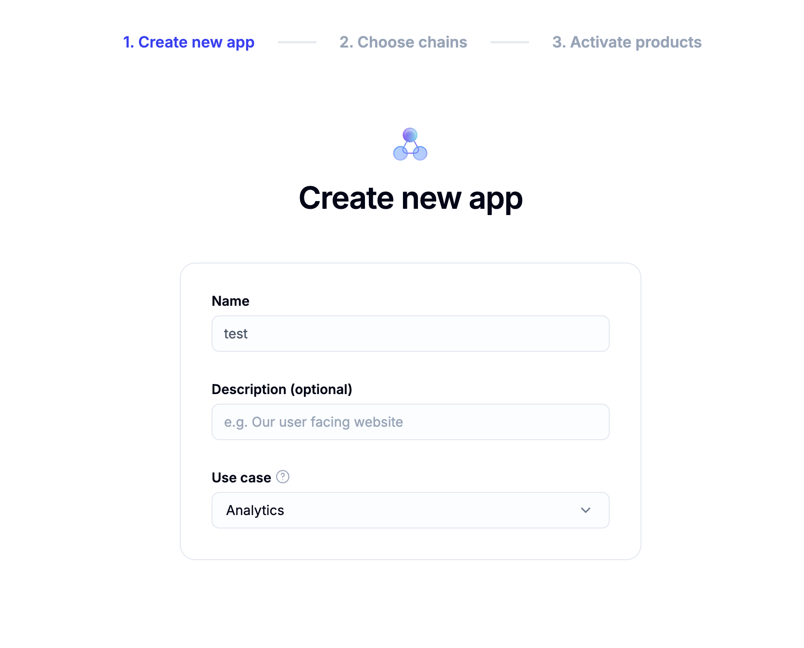
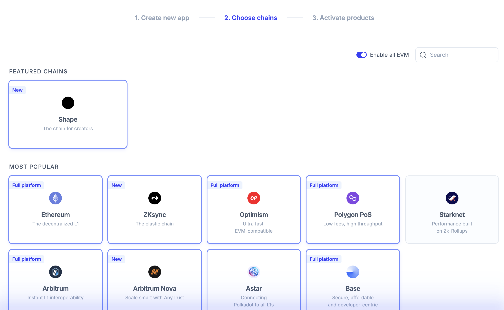
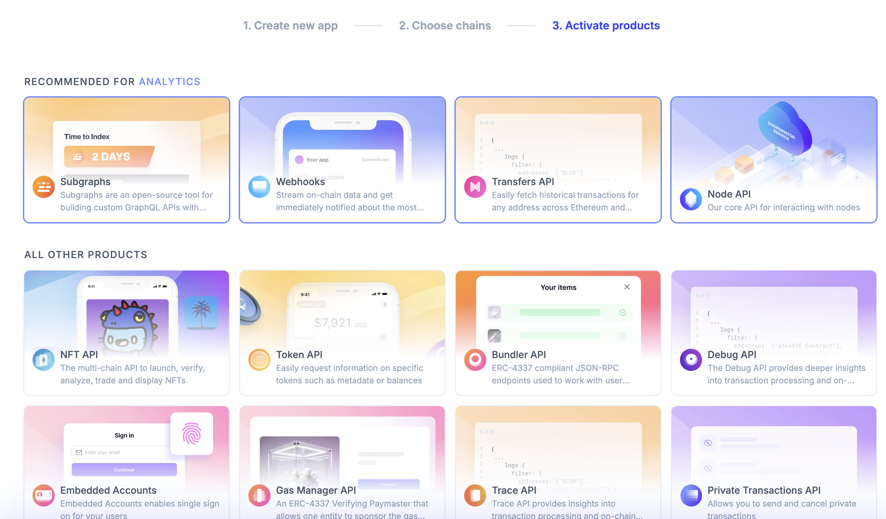

# Setting Up Your Alchemy API Key

To set up the miner, you’ll need an Alchemy API key to interact with blockchain networks like Ethereum and Polygon. Follow these steps to create your API key with the proper configurations.

### Step 1: Select Use Case - Analytics

When creating a new Alchemy API key, select **Analytics** as the use case.

---

### Step 2: Enable All EVM Chains

In the next step, ensure that **All EVM chains** is selected at the top. This will enable compatibility across all supported Ethereum-based chains.

---

### Step 3: Enable Transfers API

Finally, make sure to select **Transfers API**. This will allow the miner to track token transfers across multiple networks.

---